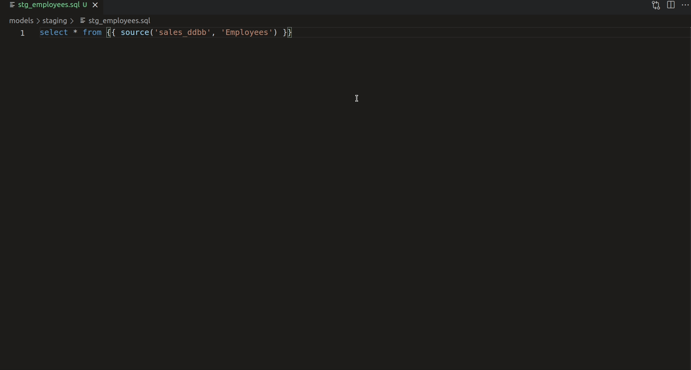

# dbt-bigquery-preview

dbt-bigquery-preview is a little extension that allows you to run [dbt](https://getdbt.com/) code directly against [BigQuery](https://cloud.google.com/bigquery) and get the results back in vscode.

Please let us know about any bugs or feature requests through the github issues.

## Features

Go to the Command Palette (shortcut: Ctrl + Shift + P) and look for `dbt-bigquery-preview: Preview dbt results`. Click there and... wait for your results!

## Requirements

For dbt-bigquery-preview to work, you have to:
- Be authenticated through the OAuth gcloud setup. If you haven't done so already, dbt Labs have a good tutorial [here](https://docs.getdbt.com/reference/warehouse-profiles/bigquery-profile#local-oauth-gcloud-setup).
- Open vscode in a dbt project.
- dbt>=0.21.0
- If you use a virtual environment to run dbt, make sure that your default terminal uses that virtual environment.

## Extension Settings

This extension contributes the following settings:

* `dbt-bigquery-preview.projectId`: Set the projectId of the BigQuery project you want to query against.
* `dbt-bigquery-preview.location`: set the location of the data you want to query.

Both of these are mandatory if you want the extension to work. In order to set them up, go to `Settings -> Extensions -> dbt-bigquery-preview`.

## Release Notes

### 0.1.0

First release! Meant for testing. Will work on Linux/Mac, not so sure about Windows.
Use under your own discretion!

### 0.2.0

Fixed bug related to how the results were rendered.